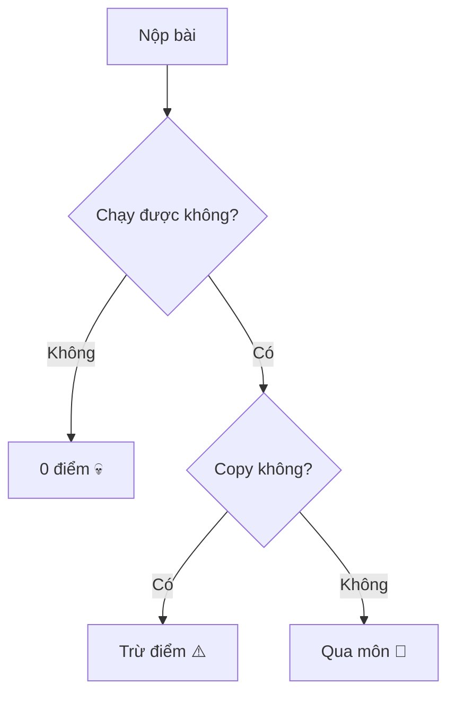

# 👨‍🏫 Thầy Giáo CNTT - Legendary Developer

> "Code chạy là được, tối ưu để sau!" – Thầy

## 🚀 Giới thiệu

Đây là README giới thiệu về **thầy giáo dạy Công Nghệ Thông Tin** của tôi – một người vừa là **developer**, vừa là **debugger**, vừa là **Google sống** của cả lớp.

* 💻 Nghề nghiệp: Thầy giáo CNTT
* 🧠 Chuyên môn: Code, sửa lỗi, và... bắt lỗi sinh viên
* ☕ Nhiên liệu hoạt động: Cà phê + StackOverflow
* 🎯 Mục tiêu: Biến sinh viên từ `Hello World` → `Full Stack Developer`

---

## 🧑‍💻 Skill Tree

| Skill                 | Level |
| --------------------- | ----- |
| Debug code sinh viên  | ⭐⭐⭐⭐⭐ |
| Giải thích thuật toán | ⭐⭐⭐⭐  |
| Viết code siêu nhanh  | ⭐⭐⭐⭐  |
| Phát hiện copy code   | ⭐⭐⭐⭐⭐ |
| Humor trong giờ học   | ⭐⭐⭐   |

---

## 📚 Công nghệ thầy thường dạy

```text
C
C++
Python
Java
HTML / CSS / JavaScript
SQL
```

Và đôi khi:

```text
Git
Linux
AI
```

---

## 🧪 Quy trình chấm bài (theo truyền thuyết)



---

## 🧠 Quote nổi tiếng của thầy

* “Lỗi không đáng sợ, **không biết sửa mới đáng sợ**.”
* “Google không làm bài giúp em đâu.”
* “Code chạy được chưa chắc đúng.”

---

## 🎮 Fun Facts

* Thầy debug nhanh hơn sinh viên compile.
* Có thể nhìn code 1 lần là biết lỗi.
* Khi lớp im lặng → chắc chắn đang có bug.

---

## 🏆 Thành tựu

* Dạy hàng trăm sinh viên biết code
* Giải cứu vô số project deadline
* Truyền cảm hứng cho nhiều lập trình viên trẻ

---

## 📞 Contact (trong lớp)

* 🏫 Classroom: Phòng máy
* ⏰ Online: Khi sinh viên bị lỗi code
* 📢 Status: `Currently debugging student's code...`

---
